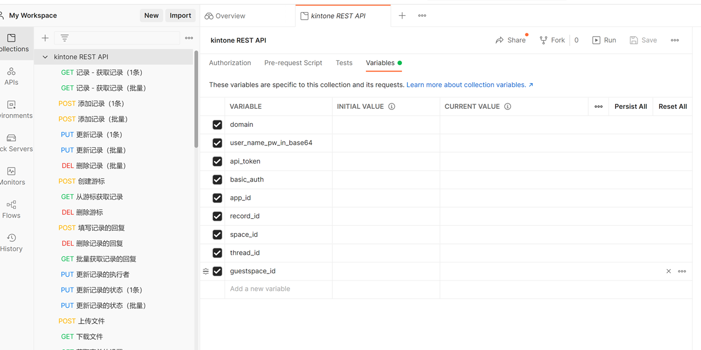
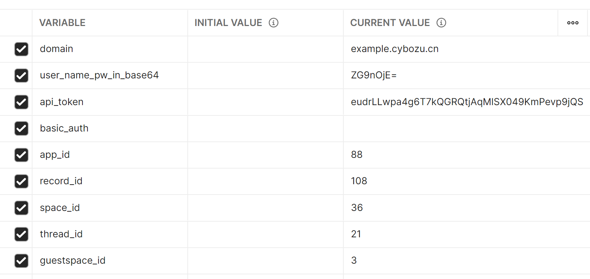
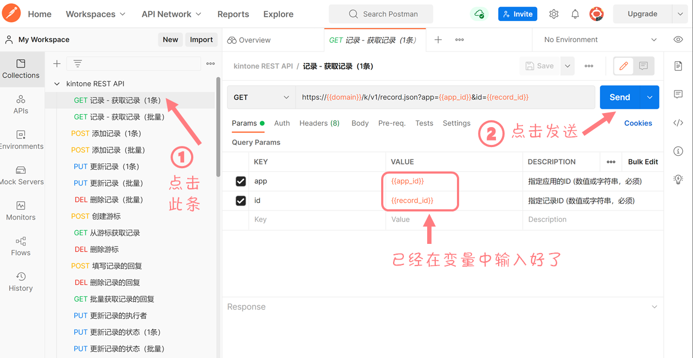
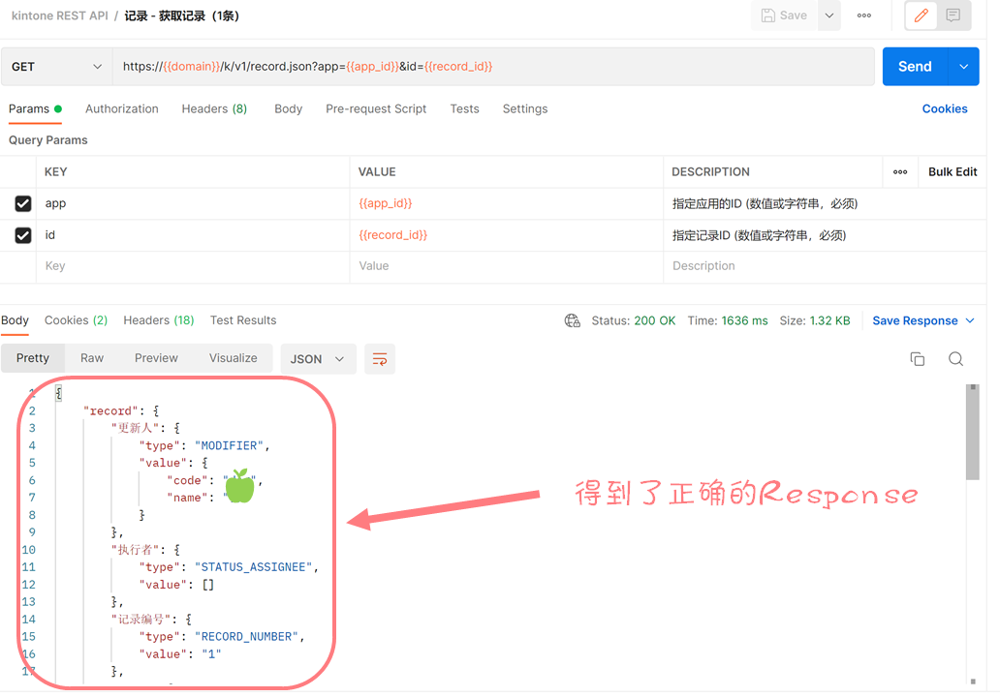
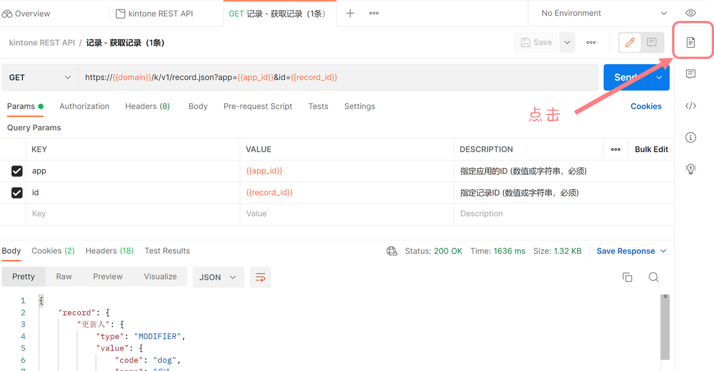
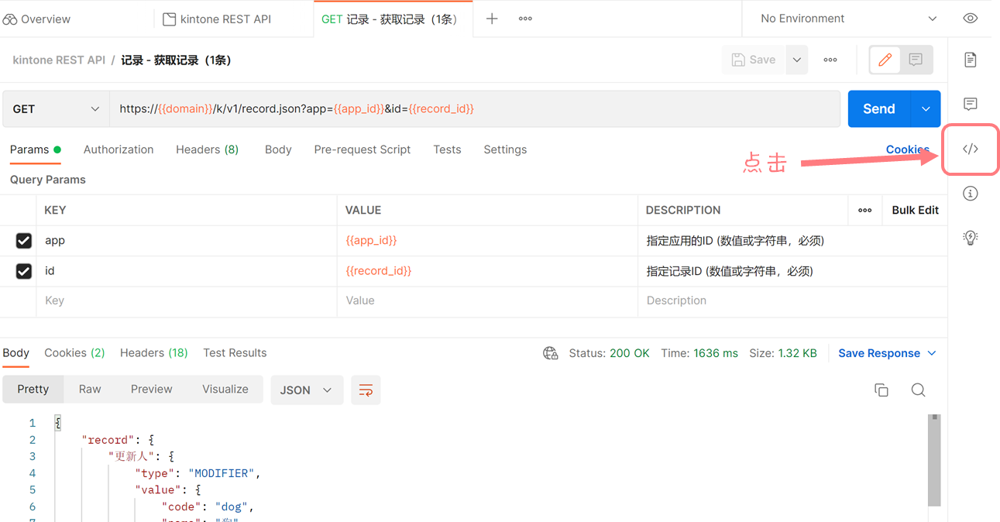
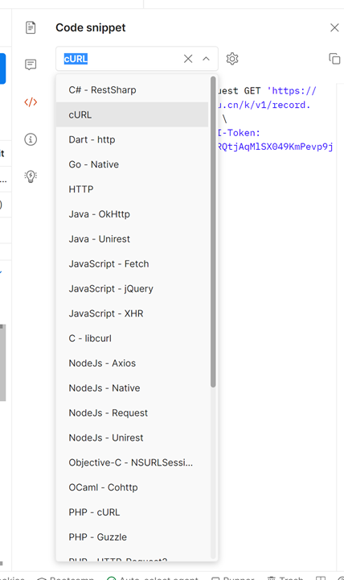

<h2>
    Index
</h2>
<ul class="anchor-link list-paddingleft-2">
    <li>
        

            <a href="#section1">前言</a>
        

    </li>
    <li>
        

            <a href="#section2">使用步骤</a>
        

    </li>
    <li>
        

            <a href="#section3">其他窍门</a>
        

    </li>
    <li>
        

            <a href="#section4">结束</a>
        

    </li>
    
</ul>
<h2>
    前言
</h2>

    众所周知，Postman是一款十分知名的网络工具。它可以模拟发送http请求，方便地调节各种参数，在前端开发中作为调试工具非常受广大开发者喜爱。

    
我们注意到，在kintone开发中，有相当多的问询是用Postman作为例子，希望指明是什么原因导致收发http请求不成功等等。在这些问询中，其实绝大部分都是由于格式不正确等简单原因造成的。譬如header名称拼写不正确、漏发关键header、JSON格式不正确等等。
    

    
而且，即使所有的参数都配置正确，我们意识到，从开发者社区文档搬运这些信息到Postman上也是不小的工作量。
    

    
为改善这类现象，帮助广大开发者更好地使用Postman来调试kintone REST API，开发者社区官方制作了一款模板的合集（Collections），所有kintone REST API的模板都已集成其中，所有header、Query Params、body格式等都预制完成。相信通过这种方式可以极大程度减少开发者调试API的工作量。
    

    

    下面就让我们跟着步骤实践一下吧！

<h2>
    使用步骤
</h2>
<h3>
    1. 准备工作
</h3>

    首先，Postman是需要注册后才能使用的，这里默认大家都已经有了帐号。

    其次，Postman可以直接在网页上打开，也可以下载本地应用程序，但操作界面都是一样的，所以这里就不分平台了。

<h3>
    1. 使用官方的分享链接导入Collections
</h3>
来到自己Postman的Workspaces下，点击导入按钮。

  

在导入窗口，点击Link，把以下这段地址拷贝到输入框内，然后点击Continue。
`https://www.getpostman.com/collections/38adfc9f34be0457831d`

  

然后出现了导入内容确认的画面，我们会发现，kintone REST API已经显示在名称中了，说明准备导入的东西是正确的。确认无误后点击Import。

  

导入成功后，Collections里会多出一个kintone REST API，点击展开，kintone的各条API就会列出来。

  

到这里，导入就完全成功了。

<h3>
    2. 配置自己kintone开发环境的变量
</h3>
使用Postman非常方便的一点是，可以预先配置好变量，在各个Request中使用变量，以后如果需要改变值，只需要改变量的值，而不需要去改所有的Request了。
我们可以利用这个功能，把需要开发测试的kintone域名，验证信息，app id，等信息统一输入在变量中。以后用起来就会非常方便。
在导入好的Collection里，已经把常用的变量都埋在了各条Request中了，我们只需要去填好这些信息。

接下来我们就是实际操作输入一下变量。
先点击kintone REST API，然后在右侧点击变量
  

我们看到，这里已经预输入了很多变量名，这些变量名是已经埋在了各条Request中，可以直接使用。
现在他们的值还都是空的，需要我们自己输入。
需要注意，输入值的地方是CURRENT VALUE，不要搞错了。改完变量别忘记按Save或者Ctrl + S 保存，否则是不会生效的。
下图中，我们已经输入好了各项值。

  

补充说明：变量可以随意增加，但改变量名必须谨慎，因为牵涉到要改所有相关Request。
<h3>
    3. 发送一条Request
</h3>
我们以列表中第一个Request——“获取记录（1条）”为例，来发送一条Request。
在列表中点击“获取记录（1条）”，将会打开一个新的tab，我们可以看到，Query Params的值已经输入好了。
在Postman中，对变量的引用要加双花括号: {{变量名}}。

  

点击发送，然后确认返回的Response。

  

这里只是用GET类的Request作为范例介绍给大家，其他POST类的，PUT类的，这里就不一一赘述了。原理都是一样的，就是配置的参数略有不同罢了。

<h2>
    其他窍门
</h2>
<h3>
    用文档中的链接访问开发者网站
</h3>
每一个Request都配有文档链接，当遇到具体问题不能解决时，可以快速找到此条Request所对应的文档链接。

在右侧工具栏找到文档按钮
  

点击打开后，找到链接地址，点击即可访问开发者网站中的相应文档。

  

<h3>
    用代码片段小工具快速创建符合你需求的代码片段
</h3>
在实际开发中，测试Request成功之后，就需要把它写成代码，搬运时也需要花费不少精力。Postman已经帮你想到了这个问题，它自带代码片段，集成了市面上流行的各种语言的写法，利用这个工具，我们写代码的速度得到的飞一般的提升。
同样在在右侧工具栏找到代码片段按钮

  

打开后在下拉框中选择你所需要的方式

  

<h2>
    结束
</h2>

以上就是本篇的所有内容了，有任何问题欢迎大家反馈留言。
